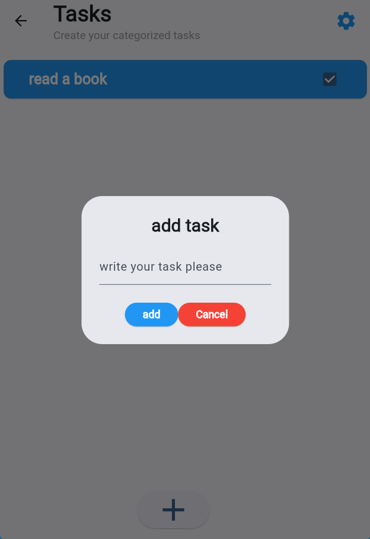
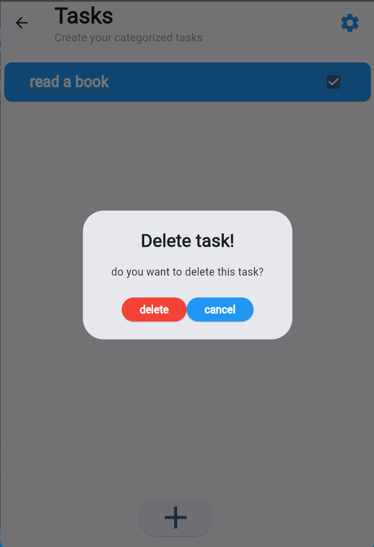

# Task Manager

A Flutter-based task management application designed to help users organize, prioritize, and track their tasks effectively.

## Features

- Add new tasks with ease
- Mark tasks as completed using checkboxes
- Delete tasks with a confirmation dialog
- User-friendly interface with categorized task management
- Real-time task status updates

## Screenshots





## Getting Started

### Prerequisites

- Flutter (latest stable version)
- Dart SDK
- Android Studio / VS Code
- An emulator or physical device for testing

### Installation

1. Clone the repository:
   ```bash
   git clone https://github.com/your-username/todolist.git
   ```

2. Navigate to the project directory:
   ```bash
   cd todolist
   ```

3. Install dependencies:
   ```bash
   flutter pub get
   ```

4. Run the app:
   ```bash
   flutter run
   ```

## Contributing

1. Fork the repository
2. Create your feature branch (`git checkout -b feature/AmazingFeature`)
3. Commit your changes (`git commit -m 'Add some AmazingFeature'`)
4. Push to the branch (`git push origin feature/AmazingFeature`)
5. Open a Pull Request

## License

This project is licensed under the MIT License - see the [LICENSE](LICENSE) file for details.

## Resources

- [Flutter Documentation](https://docs.flutter.dev/)
- [Dart Documentation](https://dart.dev/guides)
- [Flutter Community](https://flutter.dev/community)
